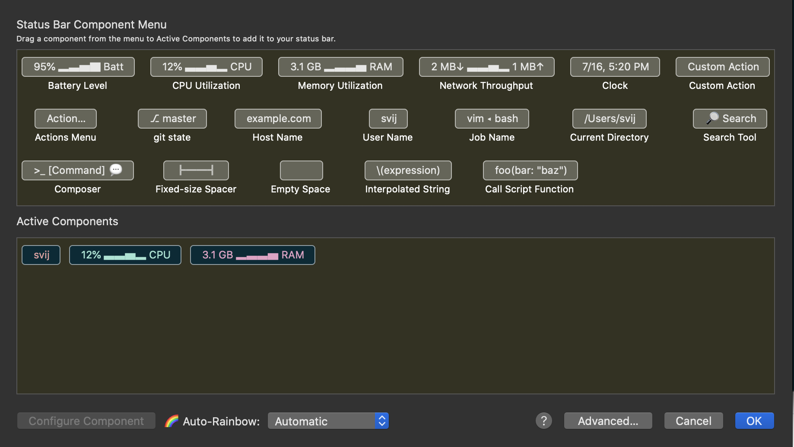

# DEV Mac Setup

This is a list of commands I use to setup my new Macs for development.
Sharing here for anyone else to use / get started.
Please feel free to adapt / improve this list.

## Install Homebrew (package manager of Mac OS)
You will need this to install alot of other stuff.
Installing homebrew will also setup much needed xcode tools on your machine needed for various compilers / other dev tools.
```bash
/bin/bash -c "$(curl -fsSL https://raw.githubusercontent.com/Homebrew/install/master/install.sh)"
```
or follow instructions on the [official website](https://brew.sh/)

## Install iterm2 (Terminal replacement)
Iterm2 is highly customizable and comes with a lot of useful features.

Now that you have homebrew installed:
```bash
brew install --cask iterm2
```

Let's open up iterm!
```
open /Applications/iTerm.app
```


## Switching Shells to ZSH
Next we are going to switch out shells from bash to zsh and make it look amazing with syntax highlighting, autocomplete, interactive directory exploration, et al.

_We are going to make your shell look something like this_:


You can either follow instructions below or follow instructions on the [Oh My Zsh wiki](https://github.com/ohmyzsh/ohmyzsh/wiki)

```bash
brew install zsh
```
To set zsh as your default shell, execute the following assuming a default install of Homebrew
```bash
chsh -s /usr/local/bin/zsh
```

Install oh-my zsh
```bash
/bin/bash -c "$(curl -fsSL https://raw.githubusercontent.com/Homebrew/install/master/install.sh)"
```

We will come back to themeing zsh, for now lets move on to installing an my favourite ide

## Installing [VSCode](https://code.visualstudio.com/) (the last ide you will ever need)
```bash
brew install --cask visual-studio-code
```
Now you can use `code (file_path|dir_path| )` to open a file, directory, or just the ide itself.


Pre-emptively fix font in vscode integrated terminal.
```
cmd + shift + p
Preferences: Open Settings (JSON)
```

Once settings.json is open add/edit the following keys
```bash
"terminal.integrated.shell.osx": "/bin/zsh",
"editor.fontFamily": "Source Code Pro for Powerline",
```

The font isn't available right now; but we will install it below.
You may update this to whatever powerline font you want to use.


## Theming your terminal

**Make iTerm your default Terminal**

From menu: _Iterm2 -> Make iTerm2 default..._


**Install Shell Integration**

From menu: _Iterm2 -> Install shell integration_


**Enable some cool features**

From menu: _View -> Show Curson, Show timestamp, Show Autocommand completion_


**Colors/Fonts/Session Bar**

Firstly, we will need to install some custom fonts.
We will chose [powerline](https://github.com/powerline/fonts).
```bash
# clone
git clone https://github.com/powerline/fonts.git --depth=1
# install
cd fonts
./install.sh
# clean-up a bit
cd ..
rm -rf fonts
```


From menu: _Iterm2 -> Settings -> Profiles -> Default -> Colors -> Color Presets -> {Chose a preset or visit the online gallery to see more}_

** You may want to uncheck Brighten Bold Text

In the same profiles section: _Iterm2 -> Preferences -> Profiles -> Default -> Session -> Status Bar Enabled -> Configure Status Bar

Mine looks like this:



In the same profiles section: _Iterm2 -> Preferences -> Profiles -> Default -> Text -> Font -> {Choose a Powerline supported font we just installed}

** I use Source Code Pro for Powerline

Ensure you see the same output
when running `echo "\ue0b0 \u00b1 \ue0a0 \u27a6 \u2718 \u26a1 \u2699"`


**Changing Theme**

You `.zshrc` file contains all information on zsh plugins and themeing. We will now edit it to make your terminal pop!

```shell
code ~/.zshrc
```

Now, that vscode has opened up with your `~/.zshrc` file,
edit the `ZSH_THEME` to a theme of your liking. The best theme in my opinon is `agnoster`
Add `DEFAULT_USER` env var while you are at it!
```
# See https://github.com/ohmyzsh/ohmyzsh/wiki/Themes
ZSH_THEME="agnoster"
DEFAULT_USER=`whoami`
```

## Install xcode and xcode CLI
```bash
xcode-select --install
```

Next, install XCode from the App Store

## Install custom python versions
Mac OS' default python versions are unreliable. It is usually better to install fresh python versions globally to ensure things install/execute adequately.

I recommend using [pyenv](https://github.com/pyenv/pyenv) to manage python versions
```bash
brew install pyenv
```

```bash
echo -e 'if command -v pyenv 1>/dev/null 2>&1; then\n  eval "$(pyenv init -)"\nfi' >> ~/.zshrc
```

Before you install python; ensure you install python build dependencies
```bash
brew install openssl readline sqlite3 xz zlib
```

Install the latest py2 and py3 versions.
Yes, sadly somethings still need py2 even though support has been dropped officially...

At the time of writing python 3.7, and 2.7.9 or higher.

If you run into any issues with installing python you can checkout https://github.com/pyenv/pyenv/wiki/common-build-problems

```bash
pyenv install 3.7.7
pyenv install 2.7.14
```

